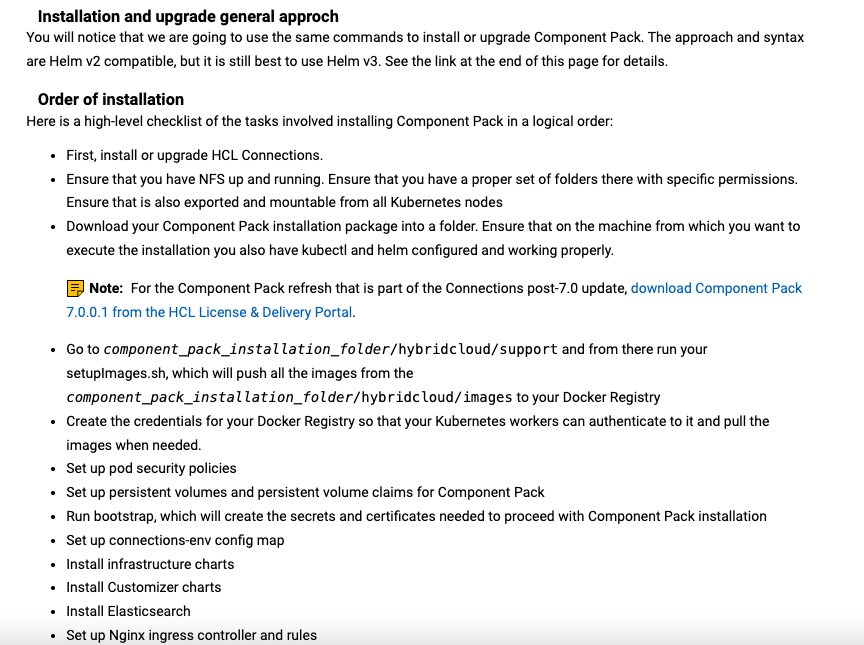

# Improving content usability

## Overview

## Problems

1. **Increased complexity.** The approach to installing and upgrading the product add-on called “Component Pack” has become more complex. Instead of a universal path, there are now multiple methods. 

2. **Navigation issue.** The user has to jump back and forth between two sections of the document, which could make the product onboarding process more frustrating and time-consuming than necessary. This is also based on developer testimonial.

3. **Content waste.** The documentation duplicates content in a way that drags maintenance efforts for the writing team. As each duplication is a repeat (not a connected module that auto-syncs), writers would need to manually update each instance.

### My solution

1. **Show, not tell.** For easier scanning, lean on visual presentation to cut back on text. This would make the content more tolerable and approachable, preventing reader frustration, overwhelm, and fatigue. 

2. **Chunk.** Separate content types. For instance, the roadmap should be one page, and the procedures another. This format would still have the user switch between two different pages, but it would lessen confusion.

3. **Simplify.** Remove duplicate content and leverage side navigation.

#### Before

This doesn’t contextualise the information, so a user wouldn’t know what to do. To be more usable and useful, why not just link to each corresponding section of the document?

This version (on another page) is useful but because it’s a long document, going back and forth between this ordered list and the actual instructions is a pain, even for myself and the developers.

#### After

Easier to scan. Easier to maintain. Easier to go through. Just easy.

## Results

- Clearer guidance for customers, resulting to reduced to no customer support tickets.

- The lead developer who worked with me on this update also praised this change multiple times, noting that the table makes it not only easier for us to track the changes but also helps customers note actions that are unique to a certain method.
