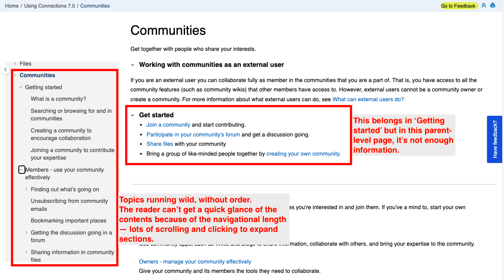
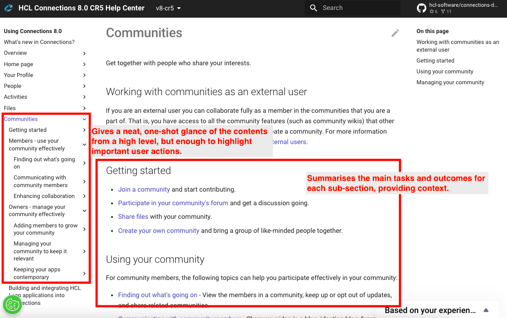

# Information rearchitecture

**Tools**: DITA, oXygen XML, Jenkins build, oXygen DITA to HTML conversion, AWS IAM S3 upload

**SMEs**: Squad lead

## Problem

The documentation for HCL Connections’ Communities app is large and disorderly, which makes it difficult for writers, developers, and customers to use and maintain the content.

In particular, these are the pain points:

- Cognitive load due to too much information too soon
- Users have to exert effort, reading, clicking, and scrolling to discover information without guidance
- Unclear grouping and information flow

Even developers felt discouraged by the format, stunting reviews.

## Solution and result

Through a card sorting and tree testing exercise, I streamlined the content categories and introduced a flow of user interactions through a high-level roadmap. I also stuck to the rule of progressive disclosure to help users achieve their goals and maximise product features. In the process, I removed content duplicates. For writers, this meant less overhead maintenance and risk of error.

### Try it out for yourself

|Before|After|
|--|--|
|[View on the HCL Connections 7.0 website](https://help.hcltechsw.com/connections/v7/user/communities/cframe.html)|[View on the HCL Connections 8.0 website](https://opensource.hcltechsw.com/connections-doc/v8/user/communities/cframe.html))

